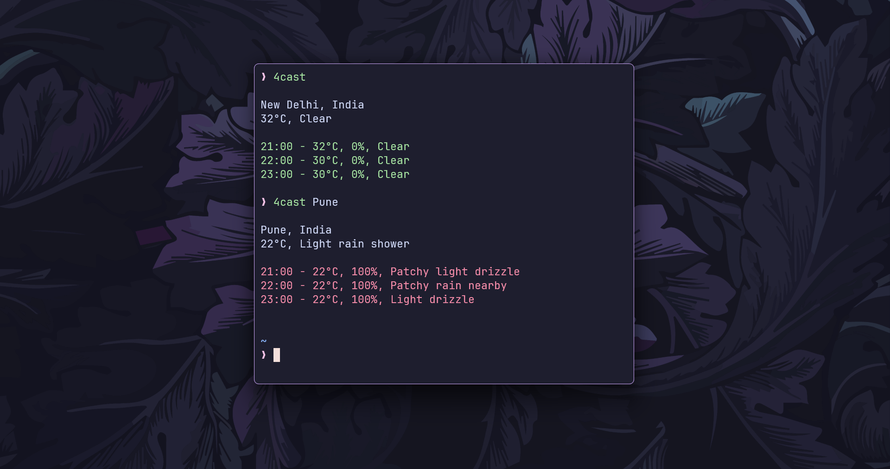

# ⛅ 4cast

4cast is a simple CLI application written in Go that provides current weather information and hourly forecasts for a specified location. 
It fetches data from the [WeatherAPI](https://www.weatherapi.com/) and displays it in a user-friendly format.



## ✨ Features

- Get the current temperature and weather conditions for any location.
- View hourly weather forecasts with temperature and chance of rain.
- Color-coded output for better readability:
  - 🟢 Green for low chance of rain.
  - 🔴 Red for high chance of rain.

## 🛠️ Installation

1. **Clone the repository**:

```bash
git clone https://github.com/ashish0kumar/4cast.git
cd 4cast
```

2. **Build the application**:

```bash
go build -o 4cast
```

3. **Run the application**:

```bash
./4cast [location]
```

Replace `[location]` with the desired city name (e.g., `New_delhi`). If no location is provided, it defaults to "New_delhi".

## 🔧 Usage

```bash
./4cast
```

**Example Output**

```bash
New Delhi, India
30°C, Clear

15:00 - 31°C, 10%, Clear
16:00 - 30°C, 20%, Partly Cloudy
17:00 - 29°C, 15%, Clear
```
